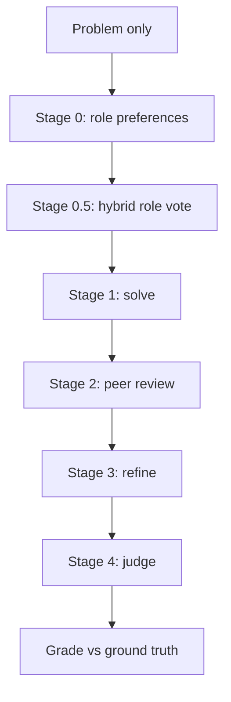

# Multi-LLM Collaborative Debate System

**Repository:** [https://github.com/Barbare997/multi-llm-debate-system](https://github.com/Barbare997/multi-llm-debate-system)  
**Team:** Tamar Shonia  · Barbare  Phantskhava

Four LLMs debate olympiad math problems: three solvers, peer review, refinement, and one judge. Compared against single-LLM and majority-vote baselines.

---

## How to run the code

### 1. Clone and install

```bash
git clone https://github.com/Barbare997/multi-llm-debate-system.git
cd multi-llm-debate-system
pip install -r requirements.txt
```

**Windows (PowerShell):** copy env file with  
`Copy-Item .env.example .env`

**Linux / macOS:**  
`cp .env.example .env`

Edit `.env` and add API keys for **OpenAI**, **Google (Gemini)**, and **Groq**.

### 2. Verify API connectivity

```bash
python scripts/check_apis.py
```

All configured backends should print `[OK]`. If Gemini or Groq hit free-tier limits, set `GEMINI_DISABLED=1` or `GROQ_DISABLED=1` in `.env`.

### 3. Run debate pipeline + baselines

```bash
# Default: all 25 problems in data/problems.json
python scripts/run_debate.py

# Quick test (2 problems)
python scripts/run_debate.py --limit 2

# AIME dataset used in our experiments
python scripts/run_debate.py --problems-file problems_medium.json

# One problem only
python scripts/run_debate.py --problems-file problems_medium.json --ids medium_01

# Debate only (skip baselines)
python scripts/run_debate.py --limit 2 --skip-baselines
```

Outputs per problem:

- `results/<problem_id>/debate.json` — full stage-by-stage debate
- `results/<problem_id>/baselines.json` — single-LLM (Groq) + majority vote

Existing result folders are **skipped**. Delete `results/<problem_id>/` to re-run.

### 4. Generate evaluation plots

```bash
python scripts/run_evaluation.py
```

Creates:

- `plots/accuracy_comparison.png`
- `plots/debate_metrics.png`
- `plots/per_problem_correctness.png`
- `plots/summary.json`
- `plots/debate_results.csv`, `plots/baseline_results.csv`


### 5. Run via notebook (alternative)

```bash
pip install jupyter
jupyter notebook notebooks/demo.ipynb
```

Run all cells to inspect `plots/summary.json`, display charts, and optionally call `run_evaluation()` from Python.

---


## Notebooks


| Notebook                                       | Description                                                                                     |
| ---------------------------------------------- | ----------------------------------------------------------------------------------------------- |
| `[notebooks/demo.ipynb](notebooks/demo.ipynb)` | Setup check, load evaluation summary, display accuracy plot, regenerate metrics from `results/` |


To run a **live** debate on one problem from the notebook (uses APIs):

```python
import sys
from pathlib import Path
ROOT = Path(".").resolve().parent  # repo root if cwd is notebooks/
sys.path.insert(0, str(ROOT))

import json
from src.config import DATA_DIR, RESULTS_DIR, get_backends, require_api_keys
from src.llm import build_clients
from src.pipeline import DebatePipeline

require_api_keys()
problems = json.loads((DATA_DIR / "problems_medium.json").read_text(encoding="utf-8"))
problem = problems[0]
backends = get_backends()
clients = build_clients(backends)
pipeline = DebatePipeline(backends, grader_client=clients["openai_strong"], verbose=True)
pipeline.run_problem(problem, save_dir=RESULTS_DIR / problem["id"])
```

---


## How the system works




| Stage   | What happens                                                                                            |
| ------- | ------------------------------------------------------------------------------------------------------- |
| **0**   | Each backend rates Solver vs Judge confidence                                                           |
| **0.5** | Each submits a role ballot; judge = hybrid score (votes + self-confidence); three others become solvers |
| **1**   | Three independent solutions (blind — no official answer)                                                |
| **2**   | Each solver reviews the other two (6 reviews)                                                           |
| **3**   | Refinement from peer feedback                                                                           |
| **4**   | Judge picks best refined solution → final answer                                                        |


**Grading** (`src/grader.py`): exact match → format check → GPT-4o grader if needed. Ground truth is never shown to solvers or judge.

**Baselines** (`src/baselines.py`): Groq single-LLM; majority vote across three backends with tie-break.

**Models:** `openai_mini` (gpt-4o-mini), `openai_strong` (gpt-4o), `gemini` (gemini-2.5-flash), `groq` (llama-3.3-70b-versatile).

---


## Datasets


| File                          | Problems                                                    |
| ----------------------------- | ----------------------------------------------------------- |
| `data/problems.json`          | 25 IZhO olympiad (`math_01`–`math_25`) — assignment dataset |
| `data/problems_medium.json`   | 25 AIME (`medium_01`–`medium_25`)                           |
| `data/problems_dataset2.json` | 15 AIME (`dataset2_01`–`dataset2_15`)                       |


Each entry: `statement`, `question_type` (`answer` / `proof`), `ground_truth_answer`, `solution_reference`.

---


## Project structure

```
notebooks/
  demo.ipynb                 # required notebook — start here in Jupyter
README.md                    # this file
scripts/
  check_apis.py              # API smoke test
  run_debate.py              # debate + baselines
  run_evaluation.py          # metrics and plots
src/                         # pipeline, grader, LLM clients, evaluation
data/                        # problem JSON files
results/<problem_id>/        # debate.json, baselines.json
plots/                       # evaluation outputs
requirements.txt
.env.example                 # copy to .env (never commit .env)
```

---


---


## Results (current eval set)

27 problems in `results/` — summary in `plots/summary.json`:


| System            | Accuracy |
| ----------------- | -------- |
| Debate            | 55.6%    |
| Majority vote     | 48.1%    |
| Single LLM (Groq) | 25.9%    |


Re-run `python scripts/run_evaluation.py` after adding more results.